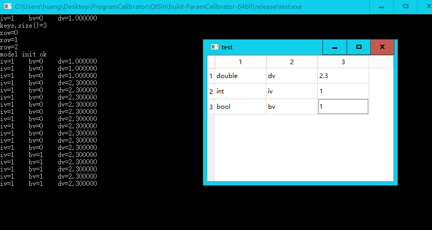

# ParamCalibrator

This library provide a GUI (based on Qt) so that a user can edit variables in the memory of the caller program. All you need to do is to include the header files in your project and make use of the provided dlls .

### Download

Please refer [release page](https://github.com/huangyuyao/ParamCalibrator/releases) of this repo to download the latest version.

### Install Guide

Please refer [wiki page](https://github.com/huangyuyao/ParamCalibrator/wiki) of this repo to figure out how to configure these DLLs into your Visual Studio Project.

### Usage

```c++
#include <iostream>
using namespace std;
#include<ParamCalibrator.h>

int main()
{
    bool bv = false;
    int iv  = 1;
    unsigned uv = 1;
    float fv = 1.0f;
    double dv = 1.0;

    Calibrator cal;

    cal.watch(Param(&iv), "iv");
    cal.watch(Param(&bv), "bv");
    cal.watch(Param(&dv), "dv");

    cal.start();

    while(1){
        printf("iv=%d\tbv=%d\tdv=%f\n", iv, bv, dv);
        Sleep(2000);
    }

    return 0;
}

```





### Dig into Source

The source file include two parts: the UserPanel contains the implementation of the user-end GUI; the InjectedHeader contains a header-only c++ class to provide memory share mechanism between different threads and code-end interface. The `InjectedHeader/main.cpp` is for demo only.

